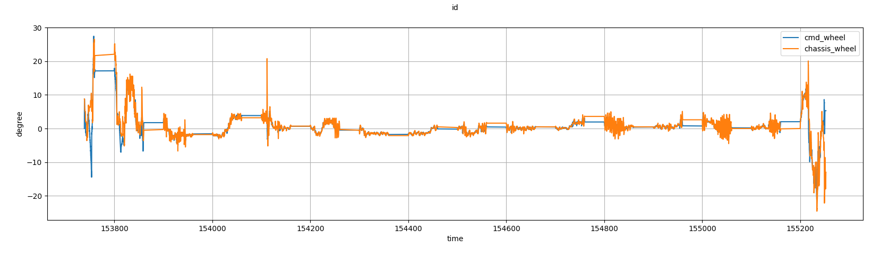
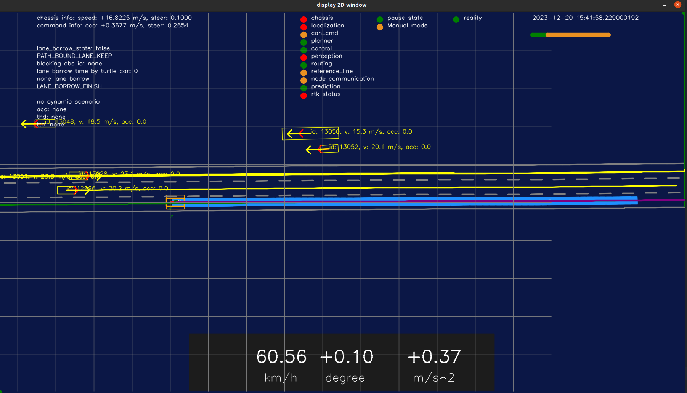
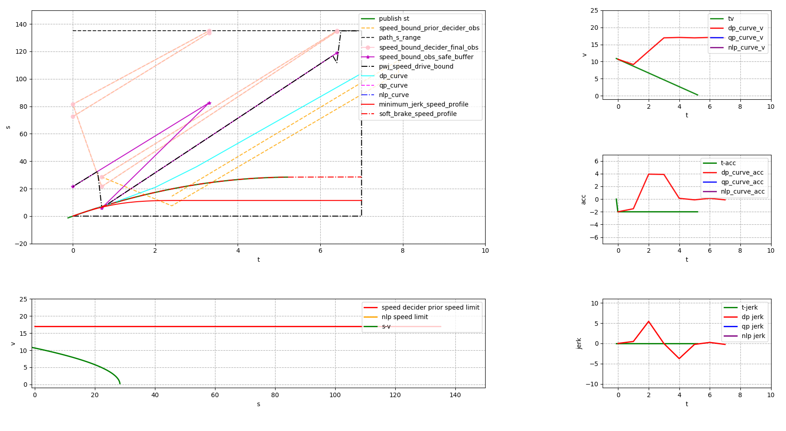
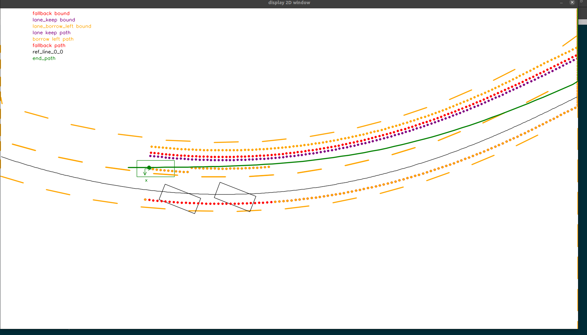

# easy apollo

这个仓库yangming开发, 早期的软件版本依赖apollo 7.0, 完全使用cmake 编译，不再依赖docker.

# 主要更新
* 编译规则使用cmake；
* 程序运行不再依赖docker，而是可以直接在ubuntu 18/20运行；
* 适配c++17；
* 增加快速碰撞检测系统，gjk/epa/bvh，由张玉博士、我在2019-2020年开发，可以参考(https://arxiv.org/abs/2011.09117);
* 增加2d的交互界面，用来实时调试系统状态；
* 增加仿真底盘，用来测试决策规划控制;
* 增加path decision调试工具;
* 增加speed decision调试工具;
* 增加record解析脚本；
* 增加log文件解析脚本；
* 通过cyber rt c++/python版本，实时订阅cyber 消息，并且完成解析，可以实时分析问题或者单步调试问题；

# 软件依赖
基本库：
1. ubuntu 18.04/20.04 (不要尝试2204，各种编译不了的问题)
1. eigen 3.3.7 （可以使用脚本安装）
1. google test 1.7.0
1. glog 0.50 （apt install）
1. benchmark 1.6.0
1. c++ 17
1. cmake
2. g++-9.4.0，ubuntu 1804默认是7.5.0，一定要使用9.4.0，不然很多库无法编译，除非在其他版本的gcc下面重新编译所有库
3. gcc-9.4.0;
5. git
6. canlib
7. python，3.6， ubuntu 20.04是3.8，ubuntu 18.04是3.6，
1. opengl


apollo 7.0依赖的库：

1. protobuf （3.14，需要cmake 编译安装）

xxx.pb.h生成cmd:

```
protoc -I=cyber/proto/ --cpp_out=cyber/proto cyber/proto/*.proto
protoc -I=cyber/proto/ --python_out=cyber/proto cyber/proto/*.proto


cd src/
protoc -I=./ --cpp_out=./ ./modules/drivers/camera/proto/*.proto
protoc -I=./ --python_out=./ ./modules/canbus/proto/*.proto
protoc -I=./ --python_out=./ ./modules/common/proto/*.proto
protoc -I=./ --python_out=./ ./modules/planning/proto/math/*.proto
protoc -I=./ --python_out=./ ./modules/planning/proto/*.proto
protoc -I=./ --python_out=./ ./modules/map/proto/*.proto
protoc -I=./ --python_out=./ ./modules/map/relative_map/proto/*.proto
protoc -I=./ --python_out=./ ./modules/routing/proto/*.proto
protoc -I=./ --python_out=./ ./modules/dreamview/proto/*.proto
protoc -I=./ --python_out=./ ./modules/perception/proto/*.proto

protoc -I=./ --python_out=./ ./modules/drivers/gnss/proto/*.proto
protoc -I=./ --python_out=./ ./modules/localization/proto/*.proto
protoc -I=./ --python_out=./ ./modules/common/configs/proto/*.proto

protoc -I=./ --python_out=./ ./modules/control/proto/*.proto

```

1. gflags,2.2
1. tinyxml2
1. boost (1.65), apt install
1. osqp(下载gitee的库source code安装),apollo 8.0 默认使用osqp 0.5.0版本
1. ipopt，3.11.9，need to apt install
1. adolc，2.6.3（apt install）
1. proj 5.0在third party中；本来想安装到third party中,名字是proj.so.13,编译可以通过，但是一运行就报错。
目前apt install 到/usr/，但是open cv4.2基于proj.so.15，所以，只需要安装opencv即可。

3. openmp，ubuntu2204自带这个库
4. opencv 4.2,
使用4.2会存在和proj4的链接冲突。源码安装4.2.0,opencv依赖gdal，gdal依赖proj4，所以，只需要安装opencv即可。

1. torch,1.10.0测试，在ubuntu2004上可以编译，可以加载模型，可以使用静态库链接torch，simulator可以正常运行。 

1. ad_rss_lib,1.1.0
1. protobuf,3.14
1. fastrtps,1.5.0
1. fast cdr,1.0.7
1. abseil, 20200225.2
1. nlohmann_json,3.8.0
1. civetweb
1. poco,1.9.0
1. pcl
1. yaml-cpp
1. ncurses
1. tf2,0.5.16
   
# 环境配置
* 到github下载源码

* 安装其他库
```

cd shell_scripts

bash install_dependence.sh


```

* 编译

```
mkdir build


<!-- 在jimu_auto 目录下，运行脚本文件 -->
./x86_compile.sh

```

* 运行

```
cd build

./launch_simulator.sh

```

# 日志系统
日志系统参考了google log和apollo log的封装，可以非常简单的记录每一个模块的日志


# 参数模块
* 使用protobuf格式作为参数，读取xxx.pb.txt文件即可；
* 使用google flag参数，可以配置文件更改，可以作为环境变量更改，可以程序启动时做为后缀输入更改参数；

# 消息
apollo 7.0使用protobuf格式作为消息格式

# HMI
自动驾驶交互界面需要开发成3d版本，并且易于交互，三维可视化常见的API包括：open scene graph，opencv 3d, open3d, rviz。
rviz是一个很方便的选择，但是依赖ros开发。剩下的包括：osg, opencv viz, open3d。opencv viz和open 3d是比较活跃的社区，
而这2个库我都没有使用过，暂时选择opencv viz开发。




* opencv viz3d,维护者较少，不推荐；
* rviz依赖ros，不推荐；
* open 3d，todo
* im gui, todo
* osg，古老的api，不推荐；
* opengl：正在使用，install_opengl.sh

* speed planning debug tool: matplot



* path planning debug tool: opencv





## 基本架构


apollo轨迹规划的压力都在纵向这边，原因如下：
* 因为横向对于动态障碍物几乎不考虑，静态障碍物几乎都nudge，存在安全性问题；
* 障碍物原因的换道没有，只有route原因的换道，存在合理性问题；
* 生成路径的时候，没有考虑速度，存在路径太平缓、转弯半径太小的问题，导致后续速度规划无解、横向加速度太大；
* 没有考虑非完整性约束
* 没有考虑横向舒适度约束，目前通过调整pwj-path优化器的平滑度来改善，实际上不同场景中很难调整参数；
* 左右避障决策，只有简单的障碍物位置而来的决策，实际上对于横向决策而言，如果不经过路径搜索，很难一直得到一个满意的结果。

# 硬件依赖
* 推荐计算单元配置：i7以上，32G内存，512G固态。
* 输入can，usb转接
* 输出can，usb转接
* 定位串口，usb转接
* 感知，以太网连接

# 实车

车辆行驶时，通过can 订阅底盘，通过can发送控制指令

启动系统：
```
cd build
./launch_real.sh

```

# 仿真
仿真包括：
* 底盘虚拟仿真
* 交通灯仿真
* 障碍物仿真

仿真底盘是一个简单的仿真，不包含车辆动力学、摩擦力学，是简单的自行车模型，输入是自行车模型的
前轮转角、加速度，输出是前轮转角、速度、加速度、车辆朝向、车辆位置。该模型是零延时模型，意味着
在输入来临时，车辆可以立马达到输入状态，不存在任何延时。

仿真环境运行步骤：

```
cd build
./launch_simulator.sh

```


# cyber rt

python 版本
```
cd jimu/


source set_python_env.bash

cd build
source set_env.sh
cd ..


python3 src/cyber/python/cyber_py3/examples/talker.py 
python3 src/cyber/python/cyber_py3/examples/listener.py 
```

cpp版本
```

cd build
./test_talker
./test_listener

```

# 记录消息
自动驾驶系统的每一个消息，都可以记录

```
launch_record.sh

```


# 回放

打开build/launch_replay.sh
修改.record文件路径，输入你想要回放的文件，比如在
./../data/log/20231122_15/20231122151401.record.00000路径.


打开global_flagfile.txt
修改replay参数
--replay_mode=true

然后运行：

```
#运行自动驾驶程序
launch_replay_apollo.sh

#运行播放程序
launch_replay.sh

```

replay时，可以加速、暂停、步进


# 编译
```
# source这一步需要优化
mkdir build

1. 方法一
cd build

cmake ..
make -j8
make install

2. 方法二，在jimu_auto 目录下，运行
./x86_compile.sh


```

# 调试
gdb调试一个单独的进程，需要输入gflag参数

```
cd build

source set_env.sh

gdb planning_component

run --vehicle_config_path=./../modules/common/data/vehicle_param.pb.txt --map_dir=./../data/sanhuan_back --flagfile=./../modules/common/data/global_flagfile.txt --smoother_config_filename=./../data/conf/planning/qp_spline_smoother_config.pb.txt

```

# 版本号

**Apollo 7.0:**


根据年份来设置版本号，例如2023.12

# 参考
* lanelet2
* apollo
* opendrive
* autoware
* bullet
* box2d
* fcl


# 编程风格
* 代码风格尽量使用[google code style:](https://zh-google-styleguide.readthedocs.io/en/latest/google-cpp-styleguide/contents/)

* 尽量使用多进程编程，这样模块化比较清晰，并且能够隔离每个模块的数据。如果使用多线程编程，当一个模块挂掉的时候，所有模块都可能挂掉；

* 每一个模块都有自己的内部实现和外部接口。为了给外部模块使用，所以写一个接口，比如xxx_module_interface.h；

* 每一个模块尽量多写单元测试，这样可以找到一些明显的错误。而且，新手在阅读单元测试时，能够帮助新手快速入门。

* 每次提交一个小功能，都需要提交git commit。不要将多个模块的改动，集合到一次commit之中。

* git commit可以按照模板：
   ```
   # <类型>:(影响范围) <主题> <JIRA?>

   # <body>

   # <footer>

   # 类型字段包含:
   #     feat：新功能（feature）
   #     fix：修复bug
   #     doc：文档（documentation）
   #     style： 格式化 ESLint调整等（不影响代码运行的变动）
   #     refactor：重构（即不是新增功能，也不是修改bug的代码变动）
   #     test：增加测试
   # 影响范围：
   #     用于说明 commit 影响的范围，比如修改的登录页、账户中心页等
   # 主题：
   #    commit目的的简短描述，不超过50个字符
   # JIRA:
   #    如果有对应的jira 请附上jira号
   # Body 部分是对本次 commit 的详细描述，可以分成多行
   # Footer用来关闭 Issue或以BREAKING CHANGE开头，后面是对变动的描述、
   #       以及变动理由和迁移方法
   ```


